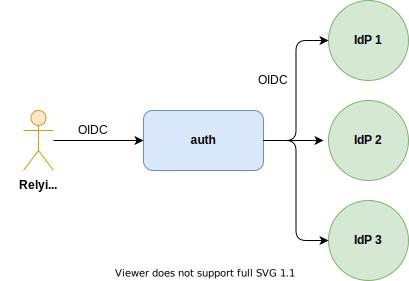

# TrustBloc hub-auth

## Overview

`hub-auth` enables [Chained Federation](https://apicrazy.com/2014/04/24/cross-domain-identity-patterns-chained-federation-service-broker/)
in the role of Service Broker. It provides end-user authentication services for other components in the TrustBloc
ecosystem as well as minimal storage containers for end-user wallets to store bootstrap data.



`hub-auth` only supports [OpenID Connect](https://openid.net/specs/openid-connect-core-1_0.html) upstream providers as
of the time of this writing.


## OpenID Service

`hub-auth` provides a standard [OIDC Discovery](https://openid.net/specs/openid-connect-discovery-1_0.html) endpoint
that your client software can use to discover the authorization, token, and userinfo endpoints.


## Bootstrap Data

Relying Parties (wallets) can post and fetch their bootstrap data by sending a request to the `/bootstrap` endpoint.
Clients must implement [RFC6750 - OAuth2.0 Bearer Token Usage](https://tools.ietf.org/html/rfc6750) in order to access
this functionality.

### Saving Bootstrap Data

**Request:**

```
POST /bootstrap
"Authorization": Bearer <base64(access_token)>

{
  "data": {
    "edvVaultID": "123",
    "webKMSKeystoreID": "abcdefg"
  }
}
```

**Response:**

```
200 Status OK
```

### Fetching Bootstrap Data

**Request:**

```
GET /bootstrap
"Authorization": Bearer <base64(access_token)>
```

**Response:**

```
200 Status OK

{
  "documentSDSURL": "https://docs.sds.example.org",
  "keySDSURL": "https://keys.sds.example.org",
  "authzKeyServerURL": "https://auth.webkms.example.org",
  "opsKeyServerURL": "https://ops.webkms.example.org",
  "data": {
    "edvVaultID": "123",
    "webKMSKeystoreID": "abcdefg"
  }
}
```

The response contains the URLs for the [Confidential Store](https://identity.foundation/confidential-storage/) and
[WebKMS](https://w3c-ccg.github.io/webkms/) services in the TrustBloc network.


## Secrets

Relying Party wallets can store user secrets in this endpoint.

> **Note:** the secret can be saved **once** per user and may never be overwritten again.

### Storing the secret

**Request:**

```
POST /secret
"Authorization": Bearer <base64(access_token)>

{
  "secret": "the user's private secret"
}
```

**Response:**

```
200 Status OK
```

### Fetching the secret

> **Note:** as of the time of this writing, the user is not allowed to fetch their own secret from hub-auth. This
> functionality is instead reserved for the user's trusted WebKMS server.

> **Note:** as of the time of this writing, this endpoint is protected by a _static api token_, not the wallet's
> OAuth2 access token.

**Request:**

```
GET /secret?sub=user_identifier
"Authorization": Bearer <base64(static_api_token)>

{
  "secret": "the user's private secret"
}
```

**Response:**

```
200 Status OK

{
  "secret": "base64(<user_secret>)"
}
```
